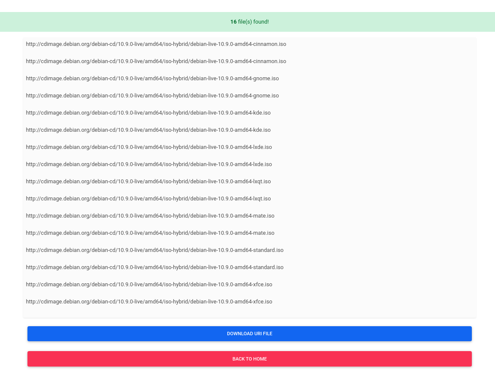

# Link Extractor
 
Extract links from Directory listing based on the extension.

## Docker

```bash
mkdir -p $(pwd)/files;
docker pull ghcr.io/jadia/link-extractor:latest && \
docker run -d --restart unless-stopped \
--name link-extractor \
-p 80:80 \
-v $(pwd)/files:/app/files \
ghcr.io/jadia/link-extractor:latest
```

## Screenshots

### Home Page


### Results Page



### Copy or Download the list of URLs

